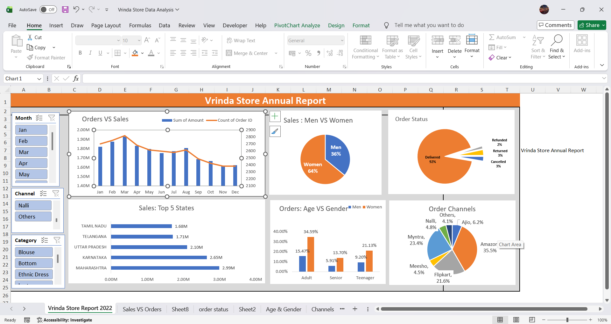

# Vrinda-Store-Sales-Analysis

## Dashboard Preview

## Project Overview
This project analyzes Vrinda Store sales data using Microsoft Excel to identify sales trends, customer behavior, and top-performing products.

## Features
- Interactive Dashboard
- Pivot Tables & Pivot Charts
- Slicers
- Sales KPIs
- Customer Analysis

## Tools Used
- Microsoft Excel
- Pivot Tables
- Pivot Charts
- Slicers
- Conditional Formatting
